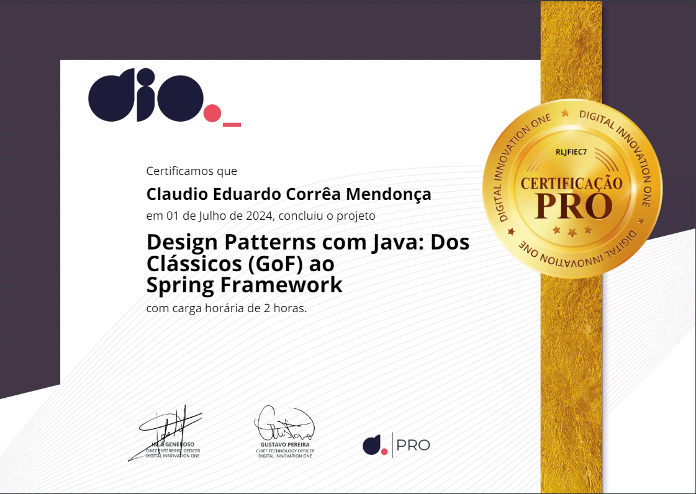

# DIO - Trilha Java Básico - Desafio Prática DESIGN PATTERS JAVA

| [](https://dio.me) |
|:--:|
| Trilha de Back-end Java do Santander Bootcamp 2024! Durante este desafio de projeto, criei uma solução que explore o conceito de Padrões de Projeto na pŕatica. reproduzir um dos projetos que criamos durante as aulas, durante o curso, adquiri um profundo entendimento sobre a implementação e utilização desses padrões, além de aprender práticas valiosas que certamente aprimoraram minhas habilidades de desenvolvimento de software. |
| <a href="https://www.youtube.com/watch?v=wtiaPK_200U" target="_blank"></a> |
| <a href="https://www.dio.me/users/claudioeduardoo" target="_blank"></a> |

<a href="https://spring.io/"></a>
<a href="https://docs.oracle.com/en/java/javase/20/"></a>

### 🚀 Desafio 

<p> Sejam bem-vindos ao desafio: <strong> DESIGN PATTERS JAVA.</strong><br>
    O objetivo principal é colocar em prática umas das principais padrões de projetos do java: <strong>Singleton, Strategy/Repository e Facade</strong> através de um projeto Java. </p>
---------------------------------------------

Oi! Gostaria de compartilhar um pouco sobre minha experiência com o curso sobre padrões de projeto em Java e Spring Framework. Durante o curso, adquiri um profundo entendimento sobre a implementação e utilização desses padrões, além de aprender práticas valiosas que certamente aprimoraram minhas habilidades de desenvolvimento de software. Aqui está um resumo do que aprendi:

### Introdução
No curso, explorei diversos padrões de projeto em Java, suas implementações manuais e como utilizá-los eficazmente com o Spring Framework.

### O que são Padrões de Projeto?
Aprendi que padrões de projeto são soluções consolidadas para problemas recorrentes de design de software. Eles fornecem uma estrutura reutilizável que melhora a qualidade, manutenção e extensibilidade do código.

### Padrões de Projeto no Java
Descobri a existência de três categorias principais de padrões de projeto:
- **Padrões de Criação**: Focados na criação de objetos.
- **Padrões Estruturais**: Tratam da composição de classes e objetos.
- **Padrões Comportamentais**: Lidam com a comunicação entre objetos.

### Implementação Manual de Padrões de Projeto
Implementar esses padrões manualmente me deu uma compreensão mais profunda de suas funcionalidades subjacentes. Aqui estão alguns exemplos que implementei:

#### Singleton
Objetivo: Garantir que uma classe tenha apenas uma instância e fornecer um ponto de acesso global a ela.

**Singleton Preguiçoso:**
```java
public class SingletonPreguicoso {
    private static SingletonPreguicoso instancia;

    private SingletonPreguicoso() {}

    public static synchronized SingletonPreguicoso getInstancia() {
        if (instancia == null) {
            instancia = new SingletonPreguicoso();
        }
        return instancia;
    }
}
```

**Singleton Apressado:**
```java
public class SingletonApressado {
    private static final SingletonApressado instancia = new SingletonApressado();

    private SingletonApressado() {}

    public static SingletonApressado getInstancia() {
        return instancia;
    }
}
```

**Singleton Lazy Holder:**
```java
public class SingletonLazyHolder {
    private static class Holder {
        private static final SingletonLazyHolder instancia = new SingletonLazyHolder();
    }

    private SingletonLazyHolder() {}

    public static SingletonLazyHolder getInstancia() {
        return Holder.instancia;
    }
}
```

#### Strategy
Objetivo: Permitir a variação de algoritmos independentemente dos clientes que os utilizam.

**Exemplo: Robô com Estratégias de Movimentação:**

Interface:
```java
public interface Comportamento {
    void mover();
}
```

Implementações:
```java
public class ComportamentoNormal implements Comportamento {
    @Override
    public void mover() {
        System.out.println("Movendo-se normalmente...");
    }
}

public class ComportamentoDefensivo implements Comportamento {
    @Override
    public void mover() {
        System.out.println("Movendo-se defensivamente...");
    }
}

public class ComportamentoAgressivo implements Comportamento {
    @Override
    public void mover() {
        System.out.println("Movendo-se agressivamente...");
    }
}
```

Uso:
```java
public class Robo {
    private Comportamento comportamento;

    public void setComportamento(Comportamento comportamento) {
        this.comportamento = comportamento;
    }

    public void mover() {
        comportamento.mover();
    }
}
```

#### Facade
Objetivo: Fornecer uma interface simplificada para um conjunto complexo de interfaces de um subsistema.

**Exemplo de Facade:**
```java
public class Facade {
    private CRMService crmService = new CRMService();
    private CEPService cepService = new CEPService();

    public void migrarCliente(String nome, String cep) {
        String cidade = cepService.recuperarCidade(cep);
        String estado = cepService.recuperarEstado(cep);
        crmService.gravarCliente(nome, cidade, estado);
    }
}
```

### Uso do Spring Framework
O curso destacou como o Spring Framework facilita a implementação desses padrões, fornecendo implementações prontas e ferramentas como IoC (Inversão de Controle) e DI (Injeção de Dependência).

### Principais Aprendizados
- **Compreensão Profunda**: Ganhei uma sólida compreensão dos tipos mais comuns de padrões de projeto e como implementá-los manualmente.
- **Uso do Spring**: Aprendi a utilizar o Spring Framework para implementar esses padrões de maneira eficiente.
- **Valor da Continuidade**: Apreciei o valor da disseminação do conhecimento e do aprendizado contínuo no campo do desenvolvimento de software.

### Estrutura de Projeto Spring
Utilizei o Spring Initializr para criar um projeto que explora os padrões de design com módulos específicos como Web, Data JPA, H2 Database, OpenFeign e Swagger.

### Conceitos Chave
- **IoC e DI**: O Spring gerencia a criação e dependências de objetos, promovendo uma separação de preocupações eficiente.
- **Prototipação Rápida**: O Spring Initializr facilita a criação rápida de projetos.
- **Consumo de API Externa**: OpenFeign permite a integração fácil com APIs externas.
- **Documentação de API**: Swagger fornece uma interface para documentar e testar APIs.

### Conclusão 🏁
Minha jornada com este curso me permitiu entender profundamente os padrões de projeto em Java e como o Spring Framework pode otimizar o desenvolvimento de software, tornando o código mais robusto e flexível.


## Certificados

- Design Patterns com Java: Dos Clássicos (GoF) ao Spring Framework

[](https://www.dio.me/certificate/TQ0JX1MW)


## Licença

<a href="https://www.buymeacoffee.com/claudiomendonca" target="_blank"></a>

Copyright © 2024 <a href="https://www.claudiomendonca.eng.br" target="_blank">ClaudioMendonca.eng.br</a> . 


----
